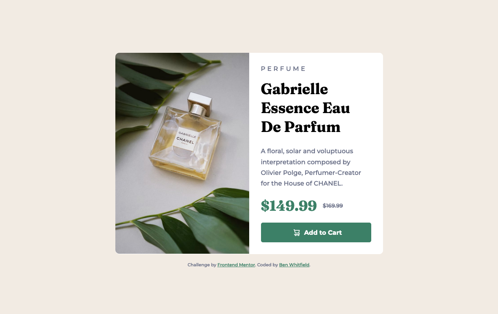

# Frontend Mentor - Product preview card component solution

This is a solution to the [Product preview card component challenge on Frontend Mentor](https://www.frontendmentor.io/challenges/product-preview-card-component-GO7UmttRfa). 

## Table of contents

- [Overview](#overview)
  - [The challenge](#the-challenge)
  - [Screenshot](#screenshot)
  - [Links](#links)
- [My process](#my-process)
  - [Built with](#built-with)
  - [What I learned](#what-i-learned)
- [Author](#author)

## Overview

### The challenge

Users should be able to:

- View the optimal layout depending on their device's screen size
- See hover and focus states for interactive elements

### Screenshot

Desktop Solution Screenshot


Mobile Solution Screenshot


### Links

- Solution URL: [Code on GitHub](https://github.com/Ben-Bot-22/Product-Preview-Card)
- Live Site URL: [GitHub pages live URL](https://ben-bot-22.github.io/Product-Preview-Card/)

## My process

### Built with

- Semantic HTML5 markup
- CSS custom properties
- Flexbox
- Mobile-first workflow
- Visual Studio Code

### What I learned

During this project I improved my media query skills to implement the site's responsive functionality.  Swapping out the main image based on screen sizes was my biggest hurdle.  

I originally tried to use the srcset attribute.  However, I was not able to get it working.  I discovered that is designed to make images look good with different screen resolutions.  

My solution (thank you [Stack Overflow](https://stackoverflow.com/questions/27853884/media-queries-and-image-swapping)) was to toggle the display property inside a media query to achieve responsiveness.

```
@media (min-width: 600px) {

  .mobile-img {
      display: none;
  }

  .desktop-img {
      display: block;
  }
}
```
## Author

- Frontend Mentor - [@Ben-Bot-22](https://www.frontendmentor.io/profile/Ben-Bot-22)
- Twitter - [@benBot22](https://www.twitter.com/benBot22)

